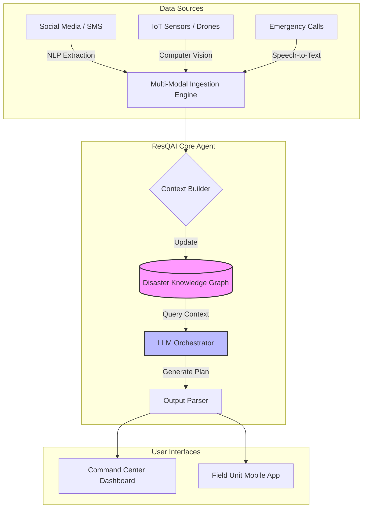

# ResQAI Architecture

## High-Level Overview

ResQAI operates on a customized **Retrieval-Augmented Generation (RAG)** architecture. Unlike standard RAG which retrieves static text chunks, ResQAI retrieves structural relationships from a **Knowledge Graph**, allowing the LLM to understand spatial and logistical dependencies.

## System Diagram (Mermaid)

## Component Breakdown

1.  **Ingestion Engine:**
    *   Normalizes unstructured data (text, audio streams) into structured `EmergencyEvent` objects.
    *   Assigns initial priority scores based on keywords (e.g., "trapped" = Priority 1).

2.  **Disaster Knowledge Graph:**
    *   A NetworkX-based graph that links Events, Locations, and Resources.
    *   *Why Graph?* It allows queries like "Find all medical units within 5km of a fire."

3.  **LLM Orchestrator (Google Gemini Pro / GPT-4):**
    *   Receives the serialized Graph Context.
    *   Role-plays as a "Disaster Coordinator".
    *   Outputs strictly formatted JSON for machine readability.
